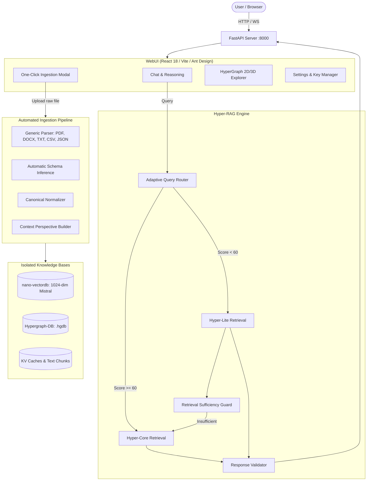

<h1 align="center">Hyper-RAG: Beyond-Pairwise Hypergraph RAG with Adaptive Routing & Automated Ingestion</h1>

<p align="center">
  
  
  
  
  <a href="https://www.nature.com/articles/s41467-026-71411-1"></a>
  <a href="https://doi.org/10.1038/s41467-026-71411-1"></a>
</p>

<p align="center">
  <a href="#overview">Overview</a> &nbsp;|&nbsp;
  <a href="#key-capabilities">Key Capabilities</a> &nbsp;|&nbsp;
  <a href="#supported-data-formats">Supported Data</a> &nbsp;|&nbsp;
  <a href="#system-architecture">Architecture</a> &nbsp;|&nbsp;
  <a href="#quickstart-in-4-steps">Quickstart</a> &nbsp;|&nbsp;
  <a href="#configuration">Configuration</a> &nbsp;|&nbsp;
  <a href="#upload--ingestion-workflow">Upload Workflow</a> &nbsp;|&nbsp;
  <a href="#testing">Testing</a> &nbsp;|&nbsp;
  <a href="#project-structure">Project Structure</a> &nbsp;|&nbsp;
  <a href="#troubleshooting">Troubleshooting</a>
</p>

---

## Overview

**Hyper-RAG** is a next-generation Retrieval-Augmented Generation (RAG) framework developed by [iMoon-Lab](http://moon-lab.tech/), Tsinghua University, and published in *Nature Communications* (2026).

Traditional Graph-RAG breaks complex relationships into pairwise edges `(entity_A, entity_B)`. This loses multi-entity context and induces hallucinations when queries require synthesizing facts across many entities simultaneously. 

Hyper-RAG models higher-order correlations natively using **hyperedges** $e = \{v_1, v_2, \dots, v_k\}$ stored in an embedded hypergraph database ([Hypergraph-DB](https://github.com/iMoonLab/Hypergraph-DB)).

This repository productizes Hyper-RAG into a complete, self-contained, and publish-ready software system featuring:
1. **Automated Generic Ingestion**: Upload raw files (PDF, DOCX, Markdown, Text, CSV, JSON, JSONL) with automatic schema inference, normalization, and hypergraph indexing.
2. **Deterministic Adaptive Routing**: Dynamically chooses between **Hyper-Lite** (lightweight entity-passage search) and **Hyper-Core** (full hypergraph diffusion) with 0 initial LLM calls.
3. **Retrieval Sufficiency Escalation**: Inspects retrieved evidence before generating answers; if Lite retrieval is insufficient, it automatically escalates to Hyper-Core.
4. **Deterministic Response Validation**: Scores generated answers across completeness ($40\%$), evidence support ($40\%$), and relevance ($20\%$).
5. **Modern Unified Web Console**: Interactive React 18 interface with Chat, 2D/3D HyperGraph Visualizer, Knowledge Base Manager, and OpenAPI docs.

---

## Key Capabilities

| Capability | Description |
| :--- | :--- |
| **Beyond-Pairwise Hypergraph** | Connects arbitrary subsets of entities within unified hyperedges, capturing complex correlations without lossy pairwise decomposition. |
| **One-Click Data Ingestion** | Upload raw documents or structured datasets directly through the WebUI. Automatically parses, synthesizes retrieval contexts, and generates isolated vector/hypergraph stores. |
| **Deterministic Adaptive Routing** | Evaluates query complexity across 8 lexical/semantic categories ($0-100$ score) before retrieval. Compact, dense queries receive an automatic semantic density bonus. |
| **Evidence Sufficiency Check** | Checks retrieved contexts before reasoning. Prevents hallucinated answers by escalating from Lite to Core when evidence density is low. |
| **Phase 3 Response Validation** | Evaluates generated responses against ground retrieved facts to ensure factual fidelity and completeness. |
| **Single-Command Startup** | FastAPI serves the compiled React application directly. Run one command to launch both backend and UI on `http://127.0.0.1:8000`. |
| **Strict Security & Privacy** | Real API keys are never exposed in logs, responses, or frontend bundles. All keys are masked (`••••••••••••1234`). |

---

## Supported Data Formats

Hyper-RAG's automatic ingestion pipeline accepts any of the following raw file types without manual preprocessing:

- **Unstructured Documents**: `.pdf`, `.docx`, `.doc`, `.txt`, `.md`
- **Structured & Semi-Structured Datasets**: `.csv`, `.json`, `.jsonl`

When uploaded, the system:
1. Detects file format and extracts text/records.
2. Infers schema types (identifiers, timestamps, titles, descriptions, categories, metrics).
3. Normalizes records into a canonical representation.
4. Synthesizes multi-perspective retrieval contexts.
5. Indexes embeddings into vector storage and relationships into a `.hgdb` hypergraph database.
6. Automatically registers the new knowledge base in the WebUI.

---

## System Architecture



---

## Quickstart in 4 Steps

### 1. Clone the Repository
```bash
git clone https://github.com/AbhishekYadav2207/Hyper-Rag.git
cd Hyper-Rag
```

### 2. Install Python Dependencies
```bash
# Optional: create a virtual environment
python -m venv venv

# Windows
.\venv\Scripts\Activate.ps1
# Linux / macOS
source venv/bin/activate

# Install all runtime dependencies
pip install -r requirements.txt
```

### 3. Configure `.env`
Copy `.env.example` to `.env` and fill in your API keys:
```bash
# Windows
Copy-Item .env.example .env
# Linux / macOS
cp .env.example .env
```
Open `.env` in any text editor and provide your keys:
```env
# Required for LLM reasoning:
OPENROUTER_API_KEY=sk-or-v1-...

# Required for 1024-dimensional dense embeddings:
MISTRAL_API_KEY=mstrl_...
```

### 4. Start the Application
Run the canonical startup command:

**Option A (Cross-Platform Python):**
```bash
python -m uvicorn web-ui.backend.main:app --host 127.0.0.1 --port 8000
```

**Option B (Convenience Scripts):**
```bash
# Windows
.\scripts\start.bat
# Linux / macOS
chmod +x ./scripts/start.sh && ./scripts/start.sh
```

Open your browser to: **`http://127.0.0.1:8000`**

*(FastAPI directly serves the production WebUI on port 8000 with zero separate frontend server needed).*

---

## Configuration

Hyper-RAG configuration is environment-driven via `.env`.

### Key Configuration Variables

| Variable | Type | Default | Description |
| :--- | :--- | :--- | :--- |
| `OPENROUTER_API_KEY` | string | *None* | Primary API key for OpenRouter LLM generation. |
| `OPENROUTER_API_KEYS` | string | *None* | Comma-separated keys for automatic round-robin rotation. |
| `OPENROUTER_MODEL` | string | `nvidia/nemotron-3-ultra-550b-a55b:free` | Model identifier used for reasoning and answer generation. |
| `OPENROUTER_BASE_URL` | string | `https://openrouter.ai/api/v1` | OpenRouter API base endpoint. |
| `MISTRAL_API_KEY` | string | *None* | Mistral AI API key for 1024-dimensional dense embeddings. |
| `EMB_API_KEYS` | string | *None* | Comma-separated Mistral keys for rotation. |
| `EMB_MODEL` | string | `mistral-embed` | Canonical embedding model (must produce 1024 dimensions). |
| `HOST` | string | `127.0.0.1` | Network interface to bind the application server. |
| `PORT` | int | `8000` | Port for the HTTP/WebSocket API and WebUI. |
| `DEFAULT_DATABASE` | string | `mock` | Default active database on startup. |
| `MAX_UPLOAD_SIZE_MB` | int | `50` | Maximum file upload size in megabytes. |
| `MAX_RECORDS` | int | `1000` | Safety guard on maximum records indexed per file. |
| `ADAPTIVE_RAG_ENABLED` | bool | `true` | Enables deterministic multi-phase adaptive routing. |
| `ADAPTIVE_CORE_THRESHOLD` | int | `60` | Complexity score threshold ($0-100$) triggering Hyper-Core. |
| `ADAPTIVE_RETRIEVAL_SUFFICIENCY_THRESHOLD` | int | `60` | Sufficiency score threshold ($0-100$) for escalation. |

### Precedence Rules
1. **Initial Bootstrap**: When `settings.json` is not present, configuration values are loaded from `.env`.
2. **Runtime Overrides**: Changes saved via the WebUI Settings view (`/#/Hyper/setting`) take immediate precedence and persist across restarts.
3. **Security Invariant**: API keys entered via WebUI or `.env` are masked (`••••••••••••1234`) and never leaked in GET responses, bundles, or console logs.

---

## Upload & Ingestion Workflow

To index your own dataset or documents:

1. Click **Upload** in the WebUI sidebar or top navigation.
2. Drag and drop any supported file (`.txt`, `.pdf`, `.docx`, `.md`, `.csv`, `.json`, `.jsonl`).
3. Click **Preflight Inspect** (optional) to view detected schema, record count, and cost estimates with **0 external API calls**.
4. Click **Start Ingestion**.
5. Watch the live progress indicator as the pipeline:
   - Normalizes records
   - Synthesizes perspective contexts
   - Computes dense Mistral embeddings
   - Builds hyperedge correlations in Hypergraph-DB
6. Once complete, select your new knowledge base from the **Database Selector** dropdown and begin querying!

---

## Testing

Hyper-RAG includes a test suite that runs **100% offline with zero external API calls or quota consumption**:

```bash
# Run all unit and integration tests
python -m pytest tests/

# Run specific test suites:
python -m pytest tests/unit/test_api_key_management.py -v   # API key security & precedence
python -m pytest tests/unit/test_adaptive_router.py -v      # Phase 1 & 2.1 complexity routing
python -m pytest tests/unit/test_retrieval_sufficiency.py -v # Phase 2 sufficiency escalation
python -m pytest tests/unit/test_response_validator.py -v   # Phase 3 response validation
python -m pytest tests/test_generic_ingestion.py -v         # Automated upload & schema pipeline
python -m pytest tests/test_tsbc_maritime.py -v            # TSBC maritime reference pipeline
```

Expected result:
```
100 passed in ~14s
```

---

## Project Structure

```
Hyper-RAG/
│
├── README.md                      # Primary project guide & documentation
├── LICENSE                        # Apache 2.0 open-source license
├── .gitignore                     # Repository ignore rules (no secrets/caches)
├── .env.example                   # Safe template for environment configuration
├── requirements.txt               # Complete Python runtime requirements
│
├── hyperrag/                      # Core Hyper-RAG engine
│   ├── adaptive_router.py         # Phase 1 & 2.1 query complexity routing
│   ├── retrieval_sufficiency.py   # Phase 2 post-retrieval sufficiency guard
│   ├── response_validator.py      # Phase 3 response evidence validation
│   ├── key_pool.py                # Multi-key round-robin rotation pool
│   ├── llm.py                     # Provider abstractions (OpenRouter & Mistral)
│   ├── operate.py                 # Core hypergraph reasoning operations
│   ├── storage.py                 # Vector & Hypergraph storage wrappers
│   └── ingestion/                 # Automated ingestion system
│       ├── parser.py              # Multi-format document parser
│       ├── schema_infer.py        # Schema inference engine
│       ├── normalizer.py          # Canonical record normalizer
│       ├── context_builder.py     # Multi-perspective context synthesizer
│       └── pipeline.py            # End-to-end ingestion pipeline
│
├── web-ui/                        # Modern full-stack Web Console
│   ├── backend/
│   │   ├── main.py                # FastAPI application, SPA host, & endpoints
│   │   ├── db.py                  # Multi-database manager
│   │   ├── file_manager.py        # File upload & path security
│   │   └── requirements.txt       # Backend dependencies
│   └── frontend/
│       ├── src/pages/             # Chat, Visualizer, DB, Settings views
│       ├── src/components/        # Reusable UI components & modals
│       ├── package.json           # React 18, Vite 6, Ant Design dependencies
│       └── dist/                  # Built production frontend assets (served by FastAPI)
│
├── datasets/                      # Reference datasets & demo fixtures
│   ├── demo/
│   │   └── employee_projects.json # Small sample dataset for upload verification
│   └── tsbc_maritime/             # Reference case study pipeline & test fixtures
│       ├── pipeline.py            # Maritime normalization pipeline
│       └── raw_reference/         # Deterministic test fixtures (16KB - 55KB)
│
├── tests/                         # Comprehensive offline test suite (100 tests)
│   ├── test_generic_ingestion.py  # Ingestion & parsing verification
│   ├── test_tsbc_maritime.py      # Maritime regression tests
│   └── unit/                      # Modular unit tests for routing & security
│
├── scripts/                       # Startup automation scripts
│   ├── start.bat                  # One-click Windows launch
│   ├── start.sh                   # One-click Linux/macOS launch
│   └── start.ps1                  # PowerShell launch
│
└── docs/                          # In-depth architectural & developer guides
    ├── ARCHITECTURE.md            # System architecture & sequence flows
    ├── USER_MANUAL.md             # End-user guide for WebUI
    ├── CONFIGURATION.md           # Complete configuration reference
    ├── API_REFERENCE.md           # FastAPI REST & WebSocket schemas
    ├── ADAPTIVE_HYPERRAG.md       # Technical specification for Adaptive RAG
    └── TROUBLESHOOTING.md         # Diagnostic runbook for common errors
```

---

## API Documentation

FastAPI provides interactive OpenAPI schemas:

- **Swagger UI**: [http://127.0.0.1:8000/docs](http://127.0.0.1:8000/docs)
- **ReDoc**: [http://127.0.0.1:8000/redoc](http://127.0.0.1:8000/redoc)
- **Health Check**: [http://127.0.0.1:8000/health](http://127.0.0.1:8000/health)

### Core Endpoints

| Method | Endpoint | Description |
| :--- | :--- | :--- |
| `GET` | `/health` | Non-sensitive system readiness and provider configuration status. |
| `GET` | `/databases` | List all discovered knowledge bases in `caches/` and `hyperrag_cache/`. |
| `GET` | `/settings` | Retrieve runtime configuration with masked key previews (`••••••••••••1234`). |
| `POST` | `/settings` | Update runtime settings and credentials dynamically without server restart. |
| `POST` | `/hyperrag/query` | Execute retrieval and answer generation (supports Adaptive, Lite, Core). |
| `POST` | `/hyperrag/query_stream` | Streaming token generation via WebSocket or SSE. |
| `POST` | `/ingestion/preflight` | Inspect an uploaded file and estimate contexts/costs (0 API calls). |
| `POST` | `/ingestion/upload-and-process` | One-click ingestion from raw file to queryable knowledge base. |

---

## Troubleshooting

### 1. `OpenRouter API key is not configured`
- **Cause**: `.env` is missing `OPENROUTER_API_KEY`, or WebUI Settings has not been configured.
- **Resolution**: Edit `.env` and set `OPENROUTER_API_KEY=sk-or-v1-...`, or navigate to **Settings** (`/#/Hyper/setting`) in the WebUI and save your key.

### 2. `Mistral API key is not configured`
- **Cause**: `.env` is missing `MISTRAL_API_KEY` or `EMB_API_KEY`.
- **Resolution**: Add `MISTRAL_API_KEY=mstrl_...` to `.env`.

### 3. Port 8000 is already in use (`WinError 10048` or `EADDRINUSE`)
- **Cause**: Another process is holding port 8000.
- **Resolution**: Run on a different port:
  ```bash
  python -m uvicorn web-ui.backend.main:app --host 127.0.0.1 --port 8005
  ```

### 4. `Frontend not built` message on `/`
- **Cause**: `web-ui/frontend/dist` has not been compiled yet.
- **Resolution**: Build the frontend once:
  ```bash
  cd web-ui/frontend
  npm install
  npm run build
  cd ../..
  ```

---

## License

This project is licensed under the Apache License 2.0. See [LICENSE](LICENSE) for details.

## Citation

If you use Hyper-RAG in your research, please cite the *Nature Communications* paper:

```bibtex
@article{hyperrag2026,
  title={Hypergraph-based retrieval-augmented generation for large language models},
  journal={Nature Communications},
  year={2026},
  doi={10.1038/s41467-026-71411-1}
}
```
