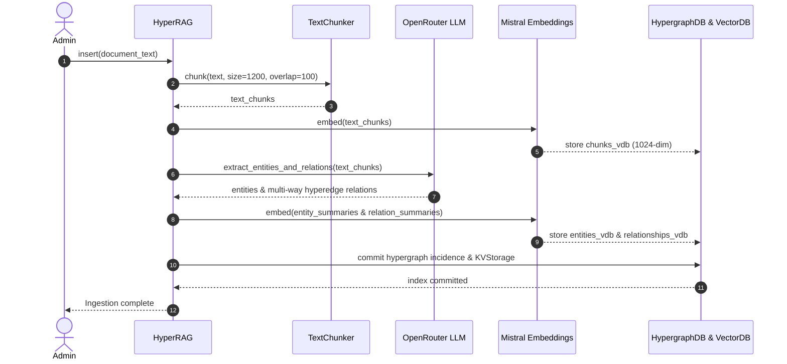
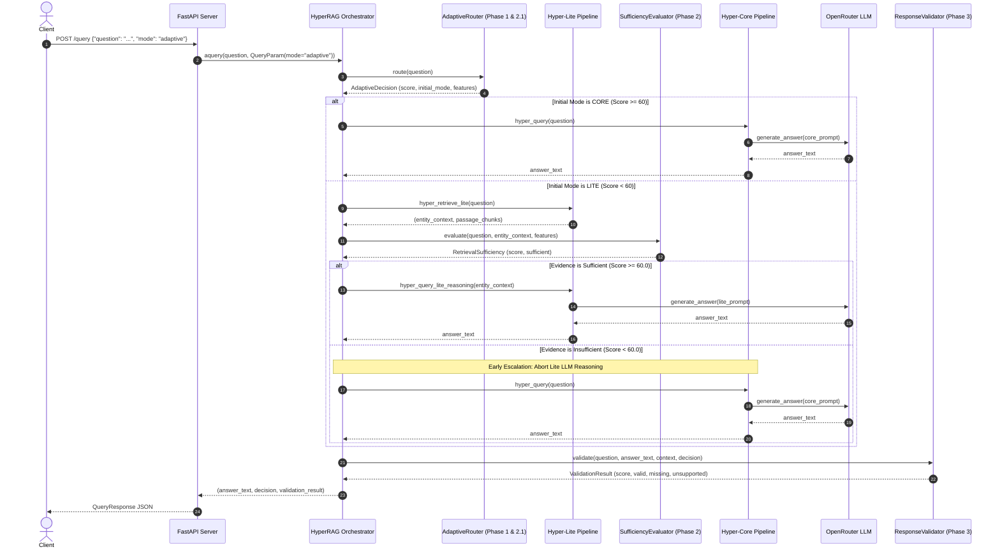
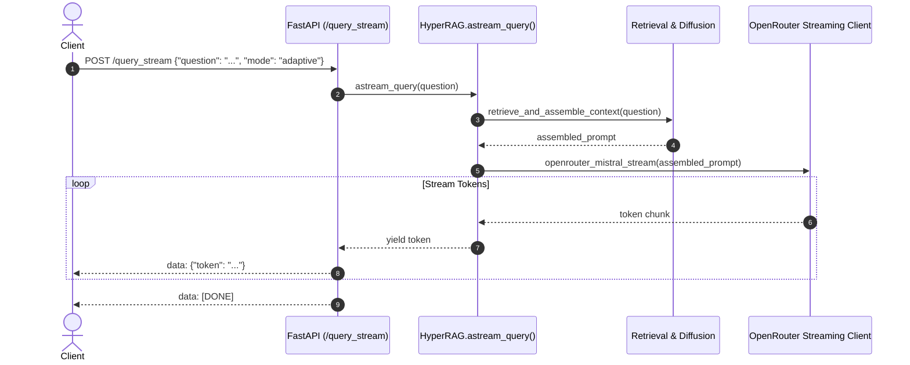

# Hyper-RAG System Architecture & Data Flow

## 1. High-Level Architectural Overview

Hyper-RAG is a state-of-the-art Retrieval-Augmented Generation (RAG) system built around high-order **hypergraph** modeling of knowledge corpora. 

Unlike traditional Graph RAG frameworks that represent facts strictly as pairwise edges $(u, v)$ between two nodes, Hyper-RAG models complex, beyond-pairwise multi-entity relationships using **hyperedges** $e = \{v_1, v_2, \dots, v_k\}$. 

To combine deep high-order reasoning with low computational cost and ultra-low latency, the system implements a dynamic, multi-layered architecture:

```text
                                  +---------------------------------------+
                                  |              User Query               |
                                  +---------------------------------------+
                                                       |
                                                       v
                                  +---------------------------------------+
                                  |     Adaptive Hyper-RAG Router         |
                                  |   (Phase 1 & 2.1 Deterministic)       |
                                  +---------------------------------------+
                                                       |
                          +----------------------------+----------------------------+
                          |                                                         |
                          v                                                         v
              [Initial Mode: Hyper-Lite]                                [Initial Mode: Hyper-Core]
                          |                                                         |
                          v                                                         |
          +--------------------------------+                                        |
          |   Lite Keyword & Entity Search |                                        |
          |     (hyper_retrieve_lite)      |                                        |
          +--------------------------------+                                        |
                          |                                                         |
                          v                                                         |
          +--------------------------------+                                        |
          | Retrieval Sufficiency Evaluator|                                        |
          |    (Phase 2 Deterministic)     |                                        |
          +--------------------------------+                                        |
                          |                                                         |
                 Is Evidence Sufficient?                                            |
                 /                     \                                            |
          YES (Score >= 60)       NO (Score < 60)                                   |
               |                        |                                           |
               |                        +------------------+                        |
               |                                           |                        |
               v                                           v                        v
+-------------------------------+             +---------------------------------------------+
|    Lite Context Assembly &    |             | Hyper-Core Retrieval & Hypergraph Diffusion |
|         LLM Reasoning         |             |                 (hyper_query)               |
+-------------------------------+             +---------------------------------------------+
               |                                                     |
               |                                                     v
               |                                       +-----------------------------+
               |                                       |   High-Order Reasoning &    |
               |                                       |      Prompt Synthesis       |
               |                                       +-----------------------------+
               |                                                     |
               +-----------------------+-----------------------------+
                                       |
                                       v
                         +----------------------------+
                         |       Final Answer         |
                         +----------------------------+
                                       |
                                       v
                         +----------------------------+
                         | Phase 3 Response Validator |
                         | (Completeness, Evidence,   |
                         |        Relevance)          |
                         +----------------------------+
                                       |
                                       v
                         +----------------------------+
                         |  Validated Answer Response |
                         +----------------------------+
```

---

## 2. Knowledge Representation & Storage Subsystem

Hyper-RAG organizes document knowledge across three complementary storage layers:

```text
Document (Raw Text)
   ├── Chunks (Text Units: ~1200 tokens each)
   │     ├── Stored in KVStorage (JsonKVStorage)
   │     └── Vectorized in chunks_vdb (Mistral 1024-dim dense vectors)
   │
   ├── Entities (Vertices in Hypergraph)
   │     ├── Named entities, concepts, categorical types, descriptions
   │     ├── Extracted via LLM schema prompting
   │     └── Vectorized in entities_vdb (Mistral 1024-dim)
   │
   ├── Relationships & Hyperedges (High-Order Edges)
   │     ├── Hyperedges connecting arbitrary subsets of entities {v1, v2, ..., vk}
   │     ├── Stored in ChunkEntityRelationHypergraph DB
   │     └── Vectorized in relationships_vdb (Mistral 1024-dim)
   │
   └── Communities & Hierarchies
         └── Clustered higher-order semantic communities for global synthesis
```

### Storage Backends
1. **`KVStorage` (`JsonKVStorage`)**: Key-value store persisting raw document text, passage chunk maps, entity metadata, and relation mappings on disk.
2. **`BaseVectorStorage` (`NanoVectorDBStorage`)**: Nearest-neighbor cosine similarity index over 1024-dimensional Mistral embeddings for:
   - `entities_vdb`: Entity names and descriptive summaries.
   - `relationships_vdb`: Hyperedge descriptions and relational summaries.
   - `chunks_vdb`: Raw text passage chunks.
3. **`ChunkEntityRelationHypergraph`**: The core hypergraph data structure tracking entity node incidence, vertex degree matrices, and multi-way edge associations.

---

## 3. Dual Execution Engines

### Hyper-Lite Pipeline (`hyper_retrieve_lite` & `hyper_query_lite_reasoning`)
- **Target Workload**: Definitional, single-entity, direct factual queries (e.g., *"What is diabetes?"*).
- **Execution Mechanism**:
  1. Extracts high-level keywords using lexical patterns.
  2. Queries `entities_vdb` for top-$k$ nearest entity embeddings.
  3. Pulls original passage chunks directly linked to matched entities.
  4. Synthesizes an answer using entity descriptions and passage chunks.
- **Latency & Compute**: Extremely fast ($<100$ ms retrieval overhead); skips hypergraph diffusion entirely.

### Hyper-Core Pipeline (`hyper_query`)
- **Target Workload**: Multi-entity, comparative, causal, temporal, and multi-hop queries (e.g., *"Compare diabetes and hypertension causes, mechanisms, and treatments"*).
- **Execution Mechanism**:
  1. Executes dual vector retrieval across both `entities_vdb` and `relationships_vdb`.
  2. Traverses the `ChunkEntityRelationHypergraph` using information diffusion across incident hyperedges.
  3. Aggregates multi-hop relational pathways and community context.
  4. Synthesizes a comprehensive answer grounded in structural hypergraph connections.
- **Latency & Compute**: Rich, high-order context preventing hallucinations on complex relational questions.

---

## 4. Multi-Phase Adaptive Subsystem

The adaptive layer dynamically coordinates execution across four deterministic phases without adding secondary LLM judge overhead:

```text
┌─────────────────────────────────────────────────────────────────────────────┐
│                       ADAPTIVE HYPER-RAG PHASES                             │
├─────────────────────────────────────────────────────────────────────────────┤
│ Phase 1:   Pre-Retrieval Query Complexity Scoring (0-100 score, 8 categories)│
│ Phase 2:   Post-Retrieval Sufficiency Evaluation (Evaluates retrieved context)│
│ Phase 2.1: Short-Query Semantic Density Refinement (+15 bonus for dense queries)│
│ Phase 3:   Post-Reasoning Deterministic Response Validation (Completeness,   │
│            Evidence Support, Relevance)                                     │
└─────────────────────────────────────────────────────────────────────────────┘
```

---

## 5. End-to-End Sequence & Data Flows

### 5.1 Ingestion & Indexing Pipeline (Offline)



### 5.2 Online Query Lifecycle (Adaptive Routing with Sufficiency & Escalation)



### 5.3 Streaming Sequence Flow (Token-by-Token SSE)



---

## 6. Provider Topology & Invariants

Hyper-RAG maintains strict separation between external providers:

```text
+--------------------------------------------------------------------------+
|                        EXTERNAL PROVIDER TOPOLOGY                        |
+--------------------------------------------------------------------------+
|                                                                          |
|   1. LLM Reasoning Engine (Primary & ONLY Reasoning Provider):           |
|      - Provider: OpenRouter (https://openrouter.ai/api/v1)              |
|      - Model: nvidia/nemotron-3-ultra-550b-a55b:free                    |
|      - Support: Non-streaming JSON & Server-Sent Events (SSE) streaming  |
|      - Fault-Tolerance: KeyPool multi-key round-robin & 429 backoff      |
|                                                                          |
|   2. Dense Embedding Engine (Embeddings ONLY):                           |
|      - Provider: Mistral AI (https://api.mistral.ai/v1)                 |
|      - Model: mistral-embed                                             |
|      - Vector Dimensions: 1024 fixed output dimensions                  |
|      - Invariant: Never used as an LLM reasoning fallback               |
|                                                                          |
+--------------------------------------------------------------------------+
```

---

## 7. Configuration Flow

1. `.env` file is read at application startup via `python-dotenv` into `my_config.py`.
2. `my_config.py` normalizes API keys, strips whitespace, parses fallback aliases (`MISTRAL_API_KEY` $\rightarrow$ `EMB_API_KEY`), and verifies configuration invariants.
3. Fast unit tests in `tests/unit/test_config.py` assert that all configuration boundaries and validation weight sums are satisfied.
4. If configuration is invalid, `validate_config()` prints clear error diagnostics without exposing secret API keys.
