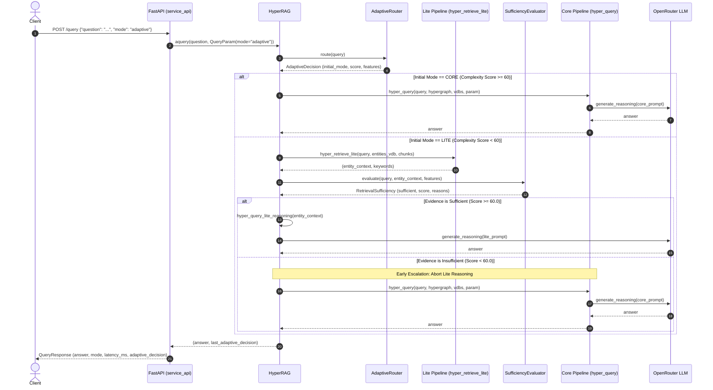

# Request and Data Flow

This document details the complete end-to-end data pipelines and execution flows of Hyper-RAG, including both the Offline Indexing Pipeline and the Online Query Execution Pipeline.

---

## 1. Indexing Data Flow (Offline / Ingestion)

When raw documents are added via `rag.insert(content)` or `rag.ainsert(content)`:

```text
[Raw Documents / Text Files]
             |
             v
     [Document Chunking]
(chunk_token_size=1200, overlap=100)
             |
             +------------------------------------+
             |                                    |
             v                                    v
     [Vector Storage]                     [LLM Extraction]
    (chunks_vdb via Mistral)        (Extract Entities & Relations)
             |                                    |
             |                                    v
             |                        [Entity & Relation Deduplication]
             |                                    |
             |                                    +--------------------+
             |                                    |                    |
             |                                    v                    v
             |                           [Entity Summaries]    [Hyperedge Formation]
             |                           (entities_vdb via     (relationships_vdb &
             |                                Mistral)           Hypergraph-DB)
             |                                    |                    |
             +------------------------------------+--------------------+
                                                  |
                                                  v
                                     [Committed Persistent Cache]
                                 (KVStorage, VectorDB, HypergraphDB)
```

### Steps in Indexing
1. **Splitting**: Input text is partitioned into overlapping chunks of approximately 1200 tokens.
2. **Chunk Vectorization**: Mistral embedding model generates 1024-dimensional dense vectors stored in `chunks_vdb`.
3. **Information Extraction**: LLM processes chunks in parallel to extract named entities, categorical types, descriptions, and multi-entity relationships.
4. **Graph Construction**: Entities become vertices in `ChunkEntityRelationHypergraph`. Relationships among arbitrary subsets of entities form high-order hyperedges.
5. **Entity & Relation Vectorization**: Entity names, descriptions, and hyperedge relationship summaries are embedded using Mistral and stored in `entities_vdb` and `relationships_vdb`.

---

## 2. Query Request Flow (Online / Real-Time)

The online query flow handles incoming client requests through FastAPI (`service_api.py`) or direct Python API calls (`HyperRAG.aquery`).

### High-Level Sequence Diagram



---

## 3. Detailed Request Pathways

### Path A: Direct Core Mode (Bypassing Router)
When a client sends `param=QueryParam(mode="core")`:
1. `_resolve_query_mode()` detects explicit mode `"core"`.
2. Leaves `last_adaptive_decision = None`.
3. Directly executes `hyper_query()`:
   - Performs parallel vector searches across `entities_vdb` and `relationships_vdb`.
   - Propagates context through incident hyperedges in `ChunkEntityRelationHypergraph`.
   - Assembles high-order contextual prompt.
   - Dispatches prompt to OpenRouter LLM for answer synthesis.

### Path B: Direct Lite Mode (Bypassing Router)
When a client sends `param=QueryParam(mode="lite")`:
1. `_resolve_query_mode()` detects explicit mode `"lite"`.
2. Leaves `last_adaptive_decision = None`.
3. Directly executes `hyper_query_lite()`:
   - Performs keyword extraction and vector entity retrieval from `entities_vdb`.
   - Collects linked text chunks.
   - Immediately dispatches prompt to OpenRouter LLM without sufficiency checks or escalation.

### Path C: Adaptive Mode — Sufficient Lite Execution
When a client sends `param=QueryParam(mode="adaptive")` with a query like *"What is diabetes?"*:
1. `AdaptiveRouter` scores complexity $\rightarrow 6 / 100$.
2. Because $6 < 60$, `initial_mode` is set to `lite`.
3. `hyper_retrieve_lite()` retrieves top entity matches and primary text chunks.
4. `RetrievalSufficiencyEvaluator` assesses the context:
   - Item count: High
   - Context length: Adequate
   - Query entity coverage: 100%
   - Relational requirements: None
   - Sufficiency score: $65.0 \ge 60.0 \rightarrow$ **SUFFICIENT**.
5. System invokes `hyper_query_lite_reasoning()` with the retrieved context.
6. OpenRouter LLM synthesizes the response.
7. Total LLM calls: **1**.

### Path D: Adaptive Mode — Insufficient Lite with Automatic Core Escalation
When a client sends `param=QueryParam(mode="adaptive")` with a query like *"What is rare_syndrome_z?"* or a multi-hop question where Lite finds isolated nodes:
1. `AdaptiveRouter` scores query complexity (e.g., $35 / 100$).
2. Because $35 < 60$, `initial_mode` is set to `lite`.
3. `hyper_retrieve_lite()` executes keyword and entity search. Lite retrieval yields empty results or disconnected fragments lacking relational links.
4. `RetrievalSufficiencyEvaluator` calculates sufficiency score (e.g., $15.0 < 60.0 \rightarrow$ **INSUFFICIENT**).
5. **Early Escalation Triggered**:
   - `decision.escalated = True`
   - `decision.final_mode = "core"`
   - Lite LLM reasoning is **completely skipped**, preserving API quota and reducing latency.
6. `hyper_query()` executes hypergraph traversal to capture multi-node hyperedges and broader context.
7. OpenRouter LLM synthesizes the response using the hypergraph-enriched context.
8. Total LLM calls: **1** (Core reasoning only).

---

## 4. Streaming Execution Flow (`/query_stream`)

When streaming responses via Server-Sent Events (SSE):

```text
FastAPI /query_stream
       |
       v
rag.astream_query()
       |
       v
_resolve_query_mode()
       |
       +---> If Escalated or Core:
       |        Calls hyper_query_stream()
       |        Yields tokens directly from OpenRouter SSE stream
       |
       +---> If Sufficient Lite:
                Calls hyper_query_lite_stream_from_context()
                Yields tokens directly from OpenRouter SSE stream
```
The client receives tokens incrementally as they are generated by OpenRouter, preserving interactive responsiveness.
