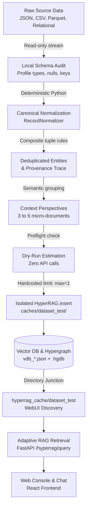
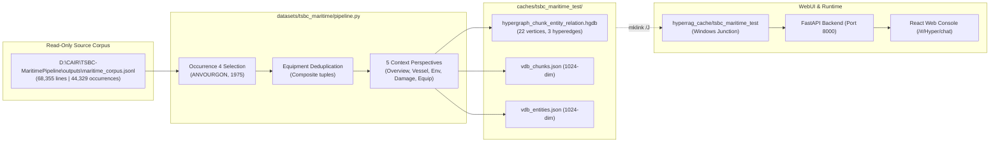
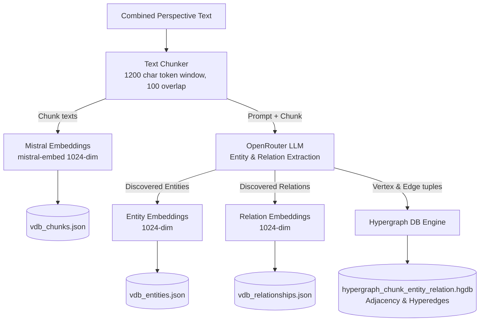
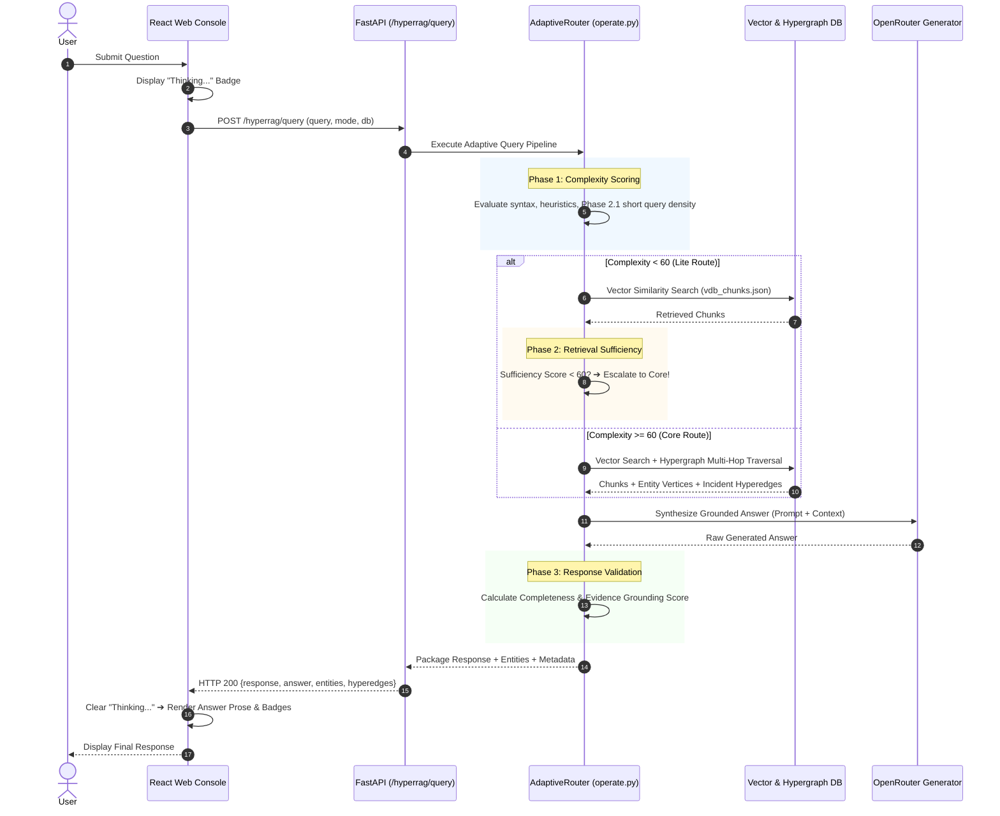
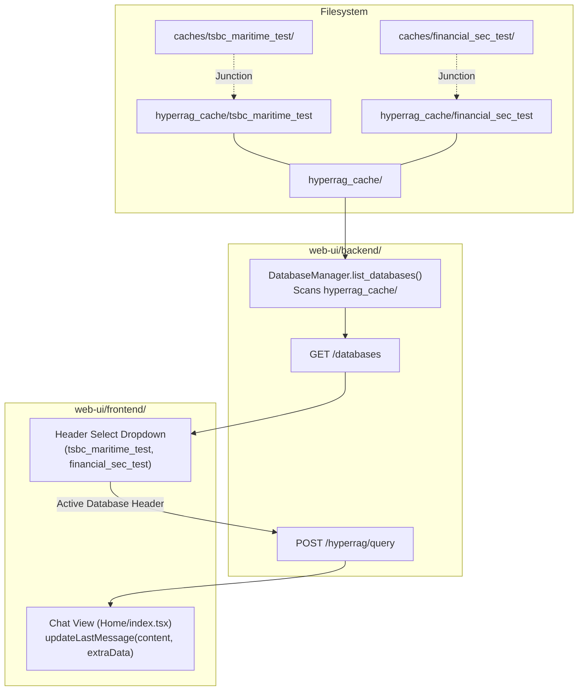
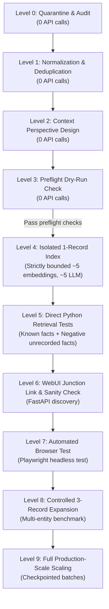
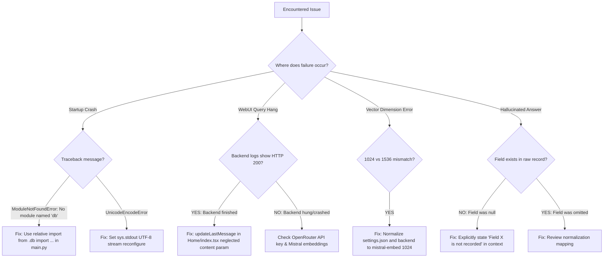

# Document 13: Architecture & Dataflow Diagrams

This document collects architectural and operational diagrams representing Hyper-RAG's data ingestion, storage, retrieval, and verification pipelines.

---

## 1. Generic Custom Dataset → Hyper-RAG End-to-End Flow

---

## 2. TSBC Maritime Implementation Architecture

---

## 3. Hyper-RAG Dual Indexing Pipeline

---

## 4. Adaptive RAG 3-Phase Query & Retrieval Lifecycle

---

## 5. WebUI & Discovery Architecture

---

## 6. API Quota-Safe 10-Level Workflow

---

## 7. Troubleshooting Decision Tree

